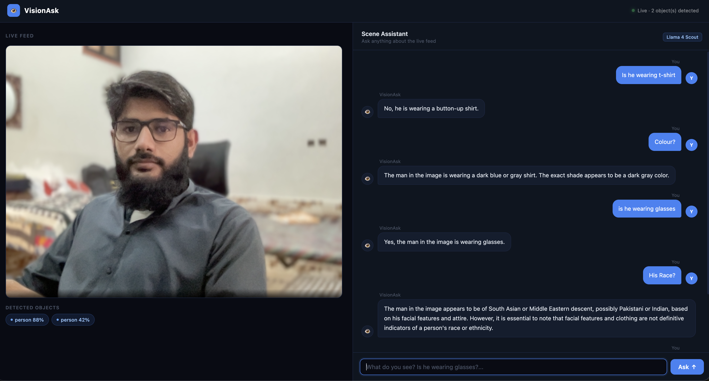

# VisionAsk

A real-time visual Q&A assistant. Point your webcam at a scene, ask anything in plain English, and get a grounded answer based on what the model actually sees in the frame.



---

## What It Does

- Captures a live webcam feed in the browser
- Runs **YOLOv8 nano** on each frame every 2.5s for real-time object detection and tracking
- On each question, captures a fresh frame and sends it to a **vision LLM** (Llama 4 Scout via Groq)
- The model sees the actual image — so it can answer questions about colours, clothing, expressions, gestures, text in the scene, and more
- Kalman-filtered object tracking provides movement context (e.g. "moved 40px left") for motion-related questions
- Clean chat UI with message history, animated thinking indicator, and live detection badges

---

## Demo

Ask things like:
- *"Is he wearing glasses?"*
- *"What colour is his shirt?"*
- *"How many people are in the frame?"*
- *"Is he waving?"*
- *"What is written on the board?"*

---

## Tech Stack

| Layer | Technology |
|---|---|
| Frontend | HTML / CSS / Vanilla JS |
| Backend | Python, FastAPI |
| Object Detection | YOLOv8 nano (`yolov8n.pt`) via Ultralytics |
| Object Tracking | Kalman filter (OpenCV) with IoU-based multi-object association |
| Vision LLM | Groq API — `meta-llama/llama-4-scout-17b-16e-instruct` |
| Communication | HTTP (JSON) between frontend and backend |

---

## How It Works

### Detection Pipeline (runs every 2.5s)

```
Webcam (getUserMedia)
  → canvas snapshot → base64 JPEG
  → POST /detect
  → YOLOv8 inference (80 COCO classes, conf ≥ 0.4)
  → Kalman filter tracker (IoU matching, prev_bbox stored)
  → detection badges shown on UI
```

### Q&A Pipeline (runs on each question)

```
User types question + clicks Ask
  → fresh frame captured from webcam
  → POST /ask  { image, objects, question }
  → image + tracker context sent to Llama 4 Scout (vision model)
  → model sees the actual frame and answers
  → response streamed into chat UI
```

### Why Both YOLO and a Vision LLM?

YOLO gives **continuous, low-latency object tracking** — it updates every 2.5s without any user action and maintains position history across frames. This is what enables motion/movement answers ("moved 40px left since last scan").

The vision LLM gives **open-ended visual understanding** — it can answer questions about anything in the image that YOLO's 80 fixed classes don't cover: colours, text, expressions, clothing, gestures, and more.

---

## Project Structure

```
VisionAsk/
├── backend/
│   ├── __init__.py
│   ├── main.py        # FastAPI app — /detect and /ask endpoints
│   ├── detector.py    # YOLOv8 inference + Kalman filter multi-object tracker
│   └── llm.py         # Groq API integration (vision model)
├── static/
│   ├── index.html     # Webcam feed + chat interface
│   ├── style.css      # Dark theme layout
│   └── app.js         # getUserMedia, scan loop, chat UI
├── scripts/
│   └── cameratest.py  # Standalone camera check (OpenCV)
├── screenshot.png
├── requirements.txt
├── .env               # GROQ_API_KEY (gitignored)
└── .gitignore
```

---

## Setup

**1. Clone and create a virtual environment**

```bash
git clone https://github.com/abdulsamadgilal/VisionAsk
cd VisionAsk
python3 -m venv venv
source venv/bin/activate
```

**2. Install dependencies**

```bash
pip install -r requirements.txt
```

**3. Add your Groq API key**

Create a `.env` file in the project root:

```
GROQ_API_KEY=your_key_here
```

Get a free key at [console.groq.com](https://console.groq.com).

**4. Run the server**

```bash
uvicorn backend.main:app --reload
```

Open `http://localhost:8000` in your browser and allow camera access.

---

## API Reference

### `POST /detect`

Runs YOLOv8 on a frame and returns tracked objects.

**Request**
```json
{ "image": "<base64_jpeg>" }
```

**Response**
```json
{
  "objects": [
    {
      "label": "person",
      "confidence": 0.86,
      "bbox": [198.3, 126.0, 244.6, 251.0],
      "prev_bbox": [211.4, 129.0, 244.6, 251.0]
    }
  ]
}
```

`bbox` format: `[x, y, width, height]` in pixels.

### `POST /ask`

Sends a frame + question to the vision model and returns an answer.

**Request**
```json
{
  "image": "<base64_jpeg>",
  "objects": [{ "label": "person", "confidence": 0.86, "bbox": [...], "prev_bbox": [...] }],
  "question": "is he wearing glasses?"
}
```

**Response**
```json
{ "answer": "Yes, the person in the frame is wearing glasses." }
```

---

## Notes

- YOLOv8n is the nano variant — fast but less accurate. Swap `yolov8n.pt` for `yolov8s.pt` or `yolov8m.pt` for better accuracy at the cost of speed.
- Movement detection requires an object to be tracked for at least 2 scans (5 seconds) before `prev_bbox` is populated.
- Groq's free tier has rate limits. If you hit them the `/ask` endpoint will return an error.
- A HTTPS context (or `localhost`) is required for `getUserMedia` camera access in the browser.
